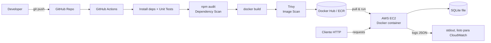

# User Management API — Proyecto DevSecOps (PBL)

Proyecto de aprendizaje basado en proyectos (PBL) cuyo objetivo es **aplicar el ciclo
completo de DevSecOps** (Plan → Code → Build → Test → Deploy → Operate → Observe)
sobre un sistema deliberadamente simple. La complejidad del ejercicio está en el
*ciclo*, no en la API.

## 1. Alcance (Scope)

**Dentro de alcance:**
- API REST para gestión de usuarios: crear, listar y obtener por id.
- Persistencia simple (SQLite).
- Contenerización con Docker.
- Pipeline CI/CD (GitHub Actions) con gate de seguridad (escaneo de dependencias y de imagen).
- Despliegue en AWS EC2.
- Observabilidad mínima: endpoint `/health` + logs estructurados en JSON.

**Fuera de alcance (decisión explícita, no descuido):**
- Autenticación/autorización (JWT, API keys).
- Update/Delete de usuarios.
- Infraestructura como código (Terraform).
- Orquestación (Kubernetes).
- Gestor de secretos centralizado (Vault / AWS Secrets Manager).
- Rate limiting.

Cada punto "fuera de alcance" se documenta en la sección de [Threat Model](#7-mini-threat-model-stride-lite)
y en [Próximos pasos](#8-próximos-pasos-fuera-de-esta-iteración) para mostrar que es una
decisión consciente de scoping, no un punto ciego.

## 2. Arquitectura



Flujo: cada `push` dispara CI → tests → **gate de seguridad** (si falla, no se construye
la imagen) → build → segundo **gate de seguridad** sobre la imagen → push al registry →
despliegue manual/scripted en EC2.

## 3. Decisiones técnicas

| Decisión | Elección | Justificación |
|---|---|---|
| Lenguaje/Framework | Node.js + Express | Rápido de levantar, ecosistema maduro de testing y de seguridad (`npm audit` nativo) |
| Base de datos | SQLite (archivo) | Evita levantar y orquestar un segundo contenedor en el tiempo disponible; suficiente para demostrar persistencia real. Trade-off documentado: no apta para múltiples instancias en producción |
| Testing | Jest + Supertest | Estándar de facto en Node para tests unitarios y de integración HTTP |
| Contenerización | Docker, build multi-stage | Estándar de la industria; multi-stage reduce superficie de ataque y tamaño de imagen |
| CI/CD | GitHub Actions | Ya se usa GitHub para control de versiones; gratis; fácil de insertar gates de seguridad |
| Escaneo de dependencias | `npm audit` | Gratuito, cero configuración, cubre vulnerabilidades conocidas en el código |
| Escaneo de imagen | Trivy | Gratuito, cubre vulnerabilidades del SO/paquetes dentro de la imagen final |
| Registro de imágenes | Docker Hub | Cuenta ya disponible, integración simple con Actions |
| Despliegue | EC2 + `docker run` vía script SSH | Sin Terraform por restricción de tiempo; deuda técnica documentada explícitamente, no oculta |
| Logs | JSON estructurado a stdout | Permite conectar luego CloudWatch/Loki/Grafana sin tocar código de negocio |

## 4. Modelo de datos

```
User {
  id:        integer (autoincrement)
  name:      string, requerido
  email:     string, requerido, único
  createdAt: timestamp, generado por el sistema
}
```

## 5. Contrato de API

| Método | Ruta | Descripción | Respuesta |
|---|---|---|---|
| GET | `/health` | Liveness/readiness check | `200 { "status": "Esta bien" }` |
| POST | `/users` | Crea usuario (`{ name, email }`) | `201` con el usuario creado / `400` validación / `409` email duplicado |
| GET | `/users` | Lista todos los usuarios | `200` array de usuarios |
| GET | `/users/:id` | Obtiene un usuario por id | `200` usuario / `404` no encontrado |

## 6. Principios de ingeniería aplicados

- Separación de capas: rutas, controladores y acceso a datos en módulos distintos.
- Validación de entrada antes de tocar la base de datos.
- Queries parametrizadas (sin concatenación de strings) para evitar inyección.
- Sin secretos ni credenciales hardcodeadas en el código (uso de variables de entorno).
- Tests automatizados como parte del pipeline, no opcionales.
- Commits e historial de git con mensajes descriptivos por fase del ciclo.

## 7. Mini Threat Model (STRIDE-lite)

| # | Activo / Endpoint | Amenaza | Riesgo | Mitigación en este proyecto | Pendiente (fuera de alcance) |
|---|---|---|---|---|---|
| 1 | `POST /users` (input) | Inyección SQL | Alto si se concatenan queries | Prepared statements + validación de input | Sanitización avanzada / WAF |
| 2 | Todos los endpoints | Falta de autenticación | Alto (cualquiera puede crear/leer usuarios) | Documentado como limitación explícita | API Key / JWT |
| 3 | Dependencias npm | CVEs conocidas | Medio | Gate `npm audit` en CI (falla build en severidad alta/crítica) | Dependabot/Renovate |
| 4 | Imagen Docker | Vulnerabilidades en imagen base/paquetes OS | Medio | Gate Trivy en CI | Imágenes distroless, firma con cosign |
| 5 | Secretos (creds DB, tokens de registry) | Exposición en código/logs | Alto si se filtran | Variables de entorno + GitHub Secrets, `.gitignore` para `.env` | Vault / AWS Secrets Manager |
| 6 | Logs | Fuga de datos sensibles | Bajo (no hay passwords en este sistema) | Logs estructurados, sin loguear bodies completos | Enmascarado de PII si se agrega auth |
| 7 | Instancia EC2 | Acceso no autorizado | Medio | Security Group: solo 22 desde IP propia, puerto de la app público y mínimo | Bastion host / SSM Session Manager |
| 8 | Disponibilidad | Sin rate limiting → abuso trivial | Bajo-Medio | Documentado como limitación | `express-rate-limit` |
| 9 | Self-hosted runner (CD) en la EC2 | Si se compromete la cuenta de GitHub o el repo, el atacante puede modificar el workflow y ejecutar código arbitrario en la EC2 | Alto, pero acotado | Riesgo aceptado conscientemente: un solo desarrollador controla ambos lados (repo y EC2); runner corre como `ec2-user` (no root) | Runner efímero por job, runner dedicado en una EC2 separada sin acceso a otros recursos, branch protection en `main` |

## 8. Próximos pasos (fuera de esta iteración)

- Terraform para IaC del EC2/Security Groups/registry.
- Orquestación (ECS o Kubernetes) en vez de un único EC2.
- Vault o AWS Secrets Manager en vez de GitHub Secrets/env vars.
- Prometheus + Grafana, o CloudWatch dashboards, sobre las métricas que hoy solo se loguean.
- Autenticación (JWT) y autorización por rol.
- Dependabot/Renovate para parcheo automático de dependencias.

## 9. Contenerización (Build)

`Dockerfile` multi-stage:

- **Stage `deps`**: instala dependencias de producción (`npm ci --omit=dev`). Incluye
  `python3 make g++` solo en este stage por si `better-sqlite3` necesita compilar
  desde fuente en alguna plataforma sin binario prebuilt — esas herramientas nunca
  llegan a la imagen final.
- **Stage final**: imagen `node:22-slim` (glibc, no alpine) corriendo como usuario
  no root (`appuser`), con `HEALTHCHECK` nativo basado en `/health` y sin `npm`/`npx`/
  `corepack` instalados, ya que el contenedor solo ejecuta `node src/server.js`.

**Por qué `slim` y no `alpine`:** `alpine` usa `musl` en vez de `glibc`, lo que en el
pasado ha causado problemas con binarios prebuilt de módulos nativos como
`better-sqlite3`. `slim` es más grande (~400MB) pero elimina ese riesgo en una noche
de tiempo limitado; quedaría como optimización futura evaluar `alpine` o una imagen
`distroless`.

**Hallazgo real durante el build:** al escanear la primera versión de la imagen con
Trivy (`trivy image --severity HIGH,CRITICAL`) apareció `CVE-2026-33671` (HIGH) en
`picomatch`, una dependencia transitiva del propio `npm` que viene empaquetado en la
imagen base `node:22-slim` — no del código de este proyecto. Como el contenedor en
producción nunca ejecuta `npm` (solo `node src/server.js`), la corrección fue eliminar
`npm`/`npx`/`corepack` de la imagen final, reduciendo superficie de ataque además de
resolver el hallazgo. Re-escaneado, el gate pasa limpio (`exit-code 1` → `0`).

## 10. Pipeline CI/CD (Test & Sec)

`.github/workflows/ci-cd.yml`, dos jobs:

1. **`test`** — `npm ci` → `npm test` (Jest/Supertest) → `npm audit --omit=dev --audit-level=high`.
   Se excluyen `devDependencies` del audit porque las únicas vulnerabilidades actuales
   del proyecto están en herramientas de testing (cadena de Jest/istanbul → `js-yaml`),
   que nunca llegan a producción; auditar solo lo que se despliega evita gatear el
   pipeline por riesgo que no existe en runtime.
2. **`build-scan-push`** (depende de `test`) — construye la imagen, la escanea con
   **Trivy** (`HIGH,CRITICAL`, `ignore-unfixed`) y, solo si es un `push` a `main`
   (no en PRs), hace login y push a Docker Hub con dos tags: el SHA del commit y
   `latest`.

**CI vs. CD — qué hace cada job, exactamente:**

- **CI (Continuous Integration) = job `test` completo** (`npm ci` → `npm test` →
  `npm audit`). Valida el **código fuente**: ¿corre?, ¿pasan los tests?, ¿sus
  dependencias son seguras? Termina con un veredicto: "este código está bien".
- **CD (Continuous Delivery) = job `build-scan-push` completo** (build de la imagen →
  Trivy scan → push a Docker Hub). Las tres partes son una sola idea: empaquetar el
  código en un artefacto desplegable, verificar que *ese artefacto* también sea
  seguro, y publicarlo. El scan de Trivy no es CI porque no valida código fuente,
  valida el paquete final — es el equivalente del `npm audit` pero para la imagen, y
  por eso vive dentro de "preparar la entrega", no dentro de "integrar código".
- **Continuous *Deployment* = job `deploy`** (un escalón más allá de Delivery): la EC2
  recibe la señal y se actualiza sola, sin que nadie corra un script a mano. Ver el
  detalle de cómo, en la sección [Deploy](#11-deploy-ec2).

**Por qué dos gates de seguridad distintos:** `npm audit` cubre vulnerabilidades en el
código/dependencias fuente; Trivy cubre la imagen final (paquetes del SO de la imagen
base + dependencias). Son superficies distintas — uno no sustituye al otro.

**Supply-chain de las propias GitHub Actions:** `aquasecurity/trivy-action` está fijada
a un commit SHA (`@ed142fd...  # v0.36.0`) en vez de a un tag mutable. Un tag de un
repo de terceros se puede re-apuntar a otro commit; un SHA no, así que pinear por SHA
es la mitigación estándar contra un ataque de supply-chain vía una Action comprometida.

**Secrets requeridos en el repo de GitHub** (Settings → Secrets and variables → Actions):

| Secret | Uso |
|---|---|
| `DOCKERHUB_USERNAME` | Usuario de Docker Hub |
| `DOCKERHUB_TOKEN` | Access Token de Docker Hub (no la contraseña) |

## 11. Deploy (EC2) — Continuous Deployment

No Terraform — decisión de alcance documentada desde el [Plan](#1-alcance-scope), no
un olvido. Pero el último salto (que la imagen nueva termine corriendo en la EC2) **sí
está automatizado**, vía un self-hosted runner de GitHub Actions.

- **Instancia**: EC2 Amazon Linux 2023, sin Docker preinstalado (se instaló como parte
  del primer despliegue: `dnf install docker`, `systemctl enable --now docker`).
- **Imagen**: se hace `docker pull` de la misma imagen pública que construyó y escaneó
  el pipeline de CI (`jruiz002/user-management-api:latest`) — no se reconstruye en el
  servidor, así el artefacto que corre en producción es exactamente el que pasó los
  gates de seguridad.
- **Persistencia**: volumen nombrado de Docker (`uma-data`) montado en `/app/data`,
  sobrevive a `docker stop`/`docker rm`/redeploys.
- **Resiliencia mínima**: `--restart unless-stopped`, para que el contenedor se
  recupere solo ante un reinicio de la instancia o un crash.
- **Security Group**: `22` (SSH) restringido a la IP propia; `80` (HTTP, mapeado al
  `3000` del contenedor) abierto públicamente para poder probar la API.

### Cómo se automatizó el último salto (job `deploy`)

Se evaluaron tres formas de lograr que la EC2 se actualice sola, todas con trade-offs
de seguridad distintos:

| Opción | Cómo conecta GitHub con la EC2 | Por qué se descartó / eligió |
|---|---|---|
| SSH desde el runner de GitHub | GitHub Actions hace SSH hacia la EC2 | Requiere guardar la private key como secret y abrir el puerto 22 a los rangos de IP (dinámicos) de los runners de GitHub — descartado por superficie de exposición |
| AWS SSM Run Command | GitHub llama a la API de AWS, SSM ejecuta el comando en la instancia | Cero puertos abiertos, pero requiere IAM role + credenciales de AWS como secret — más pasos de los que daba tiempo de configurar bien |
| **Self-hosted runner en la propia EC2 (elegida)** | La EC2 hace *polling* saliente hacia GitHub (HTTPS, puerto 443) preguntando si hay trabajo — la conexión la inicia siempre la EC2, nunca GitHub | Cero secrets nuevos (ni SSH key ni AWS key), cero puertos abiertos. El trade-off: la EC2 puede ejecutar lo que sea que diga el workflow — aceptable porque ya controlamos ambos lados |

Implementación: el runner (`actions-runner`, registrado como `ec2-uma`) corre como
servicio `systemd`, como el usuario `ec2-user` (mismo usuario en el grupo `docker`, así
no necesita `sudo` para los comandos de Docker). El job `deploy` en
`.github/workflows/ci-cd.yml` corre con `runs-on: [self-hosted, ec2]` — eso significa
"ejecútate en la EC2 misma", no en una VM de GitHub.

```yaml
deploy:
  name: Deploy to EC2 (Continuous Deployment)
  needs: build-scan-push
  if: github.event_name == 'push' && github.ref == 'refs/heads/main'
  runs-on: [self-hosted, ec2]
  steps:
    - uses: actions/checkout@v4
    - run: ./scripts/deploy-local.sh
```

`scripts/deploy-local.sh` (corre EN la EC2, sin SSH) hace lo mismo que antes hacía
`scripts/deploy.sh` por fuera: `docker pull` de `:latest`, para/elimina el contenedor
viejo, levanta el nuevo con el mismo volumen y política de reinicio.

`scripts/deploy.sh` (la versión SSH original) se conserva como mecanismo manual de
respaldo — por ejemplo, si el runner se cae o para desplegar a una instancia distinta.

**Verificado en vivo**: un `git push` a `main` dispara `test` → `build-scan-push` →
`deploy`, y sin ninguna intervención manual, el contenedor en la EC2 termina corriendo
con la imagen nueva (confirmado comparando `docker inspect -f '{{.State.StartedAt}}'`
antes y después del push).

**Verificado en vivo** (EC2 Amazon Linux 2023, `t2/t3.micro` free tier): `GET /health`,
`POST /users` y `GET /users` respondiendo correctamente desde internet, contenedor en
estado `healthy`, `docker logs` mostrando JSON estructurado, `--restart unless-stopped`
confirmado. La IP es efímera (se libera al detener la instancia) y se omite aquí a
propósito para no dejar un endpoint público sin autenticación referenciado de forma
permanente en un repo de GitHub.

## 12. Observabilidad (Operate/Observe)

- **`GET /health`**: liveness/readiness check, usado por el `HEALTHCHECK` de Docker y,
  en el siguiente paso, por un Application Load Balancer o por Kubernetes.
- **Logs estructurados en JSON** (Pino) a `stdout` — nunca a un archivo, para que
  cualquier recolector (CloudWatch Logs Agent, Fluent Bit, Loki) los pueda capturar sin
  cambios de código. Cada request deja un registro con `method`, `path`, `statusCode`
  y `durationMs`, ya filtrable/queryable por esos campos.

Evidencia real capturada desde la instancia EC2 en producción (`docker logs uma`):

```json
{"level":"info","time":"2026-06-26T06:50:39.570Z","pid":1,"hostname":"fc930af3ba9b","dbPath":"/app/data/app.db","msg":"database ready"}
{"level":"info","time":"2026-06-26T06:50:39.577Z","pid":1,"hostname":"fc930af3ba9b","port":"3000","msg":"server started"}
{"level":"info","time":"2026-06-26T06:51:02.621Z","pid":1,"hostname":"fc930af3ba9b","method":"POST","path":"/users","statusCode":201,"durationMs":2,"msg":"request completed"}
```

**Próximo paso natural** (no implementado aquí, por alcance): exponer `/metrics` con
`prom-client` y un Prometheus + Grafana (o CloudWatch Container Insights) scrapeando
esa instancia, usando exactamente los mismos campos (`statusCode`, `durationMs`) que ya
se loguean hoy — la base de datos para esos dashboards ya está sentada en este logging,
solo falta el exporter.

## 13. Cómo correr el proyecto

```bash
npm install
npm test          # corre la suite de Jest + Supertest
npm start         # levanta el servidor en :3000 (PORT configurable)
```

Con Docker:

```bash
docker build -t user-management-api .
docker volume create uma-data   # persistencia del SQLite entre reinicios
docker run -d --name uma -p 3000:3000 -v uma-data:/app/data user-management-api
docker logs -f uma
```

Variables de entorno soportadas:

| Variable | Default | Uso |
|---|---|---|
| `PORT` | `3000` | Puerto del servidor HTTP |
| `DB_PATH` | `./data/app.db` | Ruta del archivo SQLite (`:memory:` se usa en tests) |
| `LOG_LEVEL` | `info` | Nivel de log de Pino |

Ejemplo rápido:

```bash
curl http://localhost:3000/health
curl -X POST http://localhost:3000/users -H "Content-Type: application/json" \
  -d '{"name":"Ada Lovelace","email":"ada@example.com"}'
curl http://localhost:3000/users
```
