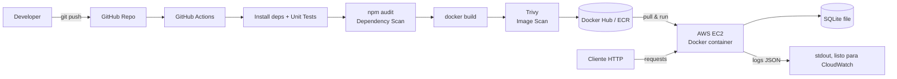

# User Management API — Proyecto DevSecOps (PBL)

Proyecto de aprendizaje basado en proyectos (PBL) cuyo objetivo es **aplicar el ciclo
completo de DevSecOps** (Plan → Code → Build → Test → Deploy → Operate → Observe)
sobre un sistema deliberadamente simple. La complejidad del ejercicio está en el
*ciclo*, no en la API.

## 1. Alcance (Scope)

**Dentro de alcance:**
- API REST para gestión de usuarios: crear, listar y obtener por id.
- Persistencia simple (SQLite).
- Contenerización con Docker.
- Pipeline CI/CD (GitHub Actions) con gate de seguridad (escaneo de dependencias y de imagen).
- Despliegue en AWS EC2.
- Observabilidad mínima: endpoint `/health` + logs estructurados en JSON.

**Fuera de alcance (decisión explícita, no descuido):**
- Autenticación/autorización (JWT, API keys).
- Update/Delete de usuarios.
- Infraestructura como código (Terraform).
- Orquestación (Kubernetes).
- Gestor de secretos centralizado (Vault / AWS Secrets Manager).
- Rate limiting.

Cada punto "fuera de alcance" se documenta en la sección de [Threat Model](#7-mini-threat-model-stride-lite)
y en [Próximos pasos](#8-próximos-pasos-fuera-de-esta-iteración) para mostrar que es una
decisión consciente de scoping, no un punto ciego.

## 2. Arquitectura



Flujo: cada `push` dispara CI → tests → **gate de seguridad** (si falla, no se construye
la imagen) → build → segundo **gate de seguridad** sobre la imagen → push al registry →
despliegue manual/scripted en EC2.

## 3. Decisiones técnicas

| Decisión | Elección | Justificación |
|---|---|---|
| Lenguaje/Framework | Node.js + Express | Rápido de levantar, ecosistema maduro de testing y de seguridad (`npm audit` nativo) |
| Base de datos | SQLite (archivo) | Evita levantar y orquestar un segundo contenedor en el tiempo disponible; suficiente para demostrar persistencia real. Trade-off documentado: no apta para múltiples instancias en producción |
| Testing | Jest + Supertest | Estándar de facto en Node para tests unitarios y de integración HTTP |
| Contenerización | Docker, build multi-stage | Estándar de la industria; multi-stage reduce superficie de ataque y tamaño de imagen |
| CI/CD | GitHub Actions | Ya se usa GitHub para control de versiones; gratis; fácil de insertar gates de seguridad |
| Escaneo de dependencias | `npm audit` | Gratuito, cero configuración, cubre vulnerabilidades conocidas en el código |
| Escaneo de imagen | Trivy | Gratuito, cubre vulnerabilidades del SO/paquetes dentro de la imagen final |
| Registro de imágenes | Docker Hub | Cuenta ya disponible, integración simple con Actions |
| Despliegue | EC2 + `docker run` vía script SSH | Sin Terraform por restricción de tiempo; deuda técnica documentada explícitamente, no oculta |
| Logs | JSON estructurado a stdout | Permite conectar luego CloudWatch/Loki/Grafana sin tocar código de negocio |

## 4. Modelo de datos

```
User {
  id:        integer (autoincrement)
  name:      string, requerido
  email:     string, requerido, único
  createdAt: timestamp, generado por el sistema
}
```

## 5. Contrato de API

| Método | Ruta | Descripción | Respuesta |
|---|---|---|---|
| GET | `/health` | Liveness/readiness check | `200 { "status": "ok" }` |
| POST | `/users` | Crea usuario (`{ name, email }`) | `201` con el usuario creado / `400` validación / `409` email duplicado |
| GET | `/users` | Lista todos los usuarios | `200` array de usuarios |
| GET | `/users/:id` | Obtiene un usuario por id | `200` usuario / `404` no encontrado |

## 6. Principios de ingeniería aplicados

- Separación de capas: rutas, controladores y acceso a datos en módulos distintos.
- Validación de entrada antes de tocar la base de datos.
- Queries parametrizadas (sin concatenación de strings) para evitar inyección.
- Sin secretos ni credenciales hardcodeadas en el código (uso de variables de entorno).
- Tests automatizados como parte del pipeline, no opcionales.
- Commits e historial de git con mensajes descriptivos por fase del ciclo.

## 7. Mini Threat Model (STRIDE-lite)

| # | Activo / Endpoint | Amenaza | Riesgo | Mitigación en este proyecto | Pendiente (fuera de alcance) |
|---|---|---|---|---|---|
| 1 | `POST /users` (input) | Inyección SQL | Alto si se concatenan queries | Prepared statements + validación de input | Sanitización avanzada / WAF |
| 2 | Todos los endpoints | Falta de autenticación | Alto (cualquiera puede crear/leer usuarios) | Documentado como limitación explícita | API Key / JWT |
| 3 | Dependencias npm | CVEs conocidas | Medio | Gate `npm audit` en CI (falla build en severidad alta/crítica) | Dependabot/Renovate |
| 4 | Imagen Docker | Vulnerabilidades en imagen base/paquetes OS | Medio | Gate Trivy en CI | Imágenes distroless, firma con cosign |
| 5 | Secretos (creds DB, tokens de registry) | Exposición en código/logs | Alto si se filtran | Variables de entorno + GitHub Secrets, `.gitignore` para `.env` | Vault / AWS Secrets Manager |
| 6 | Logs | Fuga de datos sensibles | Bajo (no hay passwords en este sistema) | Logs estructurados, sin loguear bodies completos | Enmascarado de PII si se agrega auth |
| 7 | Instancia EC2 | Acceso no autorizado | Medio | Security Group: solo 22 desde IP propia, puerto de la app público y mínimo | Bastion host / SSM Session Manager |
| 8 | Disponibilidad | Sin rate limiting → abuso trivial | Bajo-Medio | Documentado como limitación | `express-rate-limit` |

## 8. Próximos pasos (fuera de esta iteración)

- Terraform para IaC del EC2/Security Groups/registry.
- Orquestación (ECS o Kubernetes) en vez de un único EC2.
- Vault o AWS Secrets Manager en vez de GitHub Secrets/env vars.
- Prometheus + Grafana, o CloudWatch dashboards, sobre las métricas que hoy solo se loguean.
- Autenticación (JWT) y autorización por rol.
- Dependabot/Renovate para parcheo automático de dependencias.

## 9. Cómo correr el proyecto

```bash
npm install
npm test          # corre la suite de Jest + Supertest
npm start         # levanta el servidor en :3000 (PORT configurable)
```

Variables de entorno soportadas:

| Variable | Default | Uso |
|---|---|---|
| `PORT` | `3000` | Puerto del servidor HTTP |
| `DB_PATH` | `./data/app.db` | Ruta del archivo SQLite (`:memory:` se usa en tests) |
| `LOG_LEVEL` | `info` | Nivel de log de Pino |

Ejemplo rápido:

```bash
curl http://localhost:3000/health
curl -X POST http://localhost:3000/users -H "Content-Type: application/json" \
  -d '{"name":"Ada Lovelace","email":"ada@example.com"}'
curl http://localhost:3000/users
```
